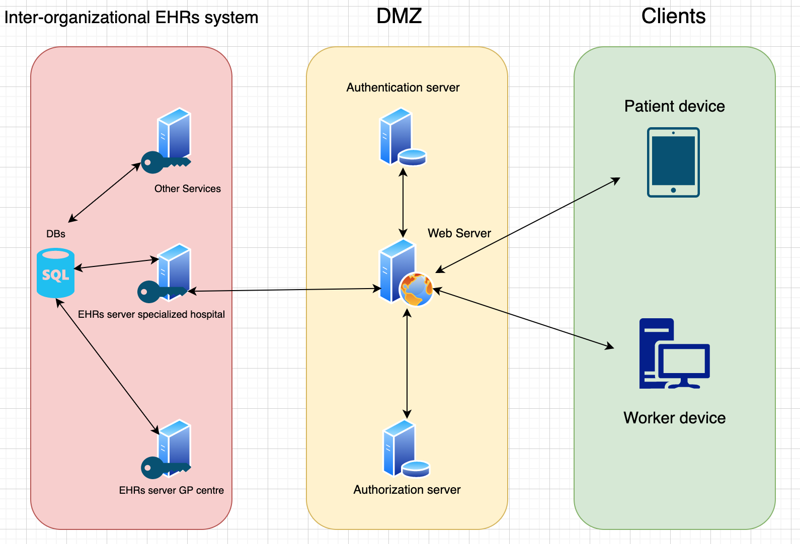

High-Level System Architecture
==============================

Our system is planned to act as a web-application for both mobile and bigger sized screens.
When a patient or healthcare worker connects, requests will be made towards the webserver
which responds with the corresponding markup. When a user, meaning either a patient or healthcare worker,
tries to login into the system, an authentication server/system will decide whether the user is cleared for authorization.
If so, the authorization server will decide which services and resources the logged-in user has permission to access.

Permission handling is important for the system to work correctly and for retaining confidentiality.
Different types of users should have access to different kind of resources and services,
depending on which role the user has in the system. Upon authentication, the logged-in users role
is set (e.g. through session related variables) thus authorizes the user for different services.
As an example, patients should not have access to the same kind of internal information as GP's.
Some employees might also have differences in permissions and authorization.

After authentication, the user communicates to different EHR services depending on what
he or she is authorized to. These services communicates with databases that stores corresponding
user data information mentioned earlier in this report.
