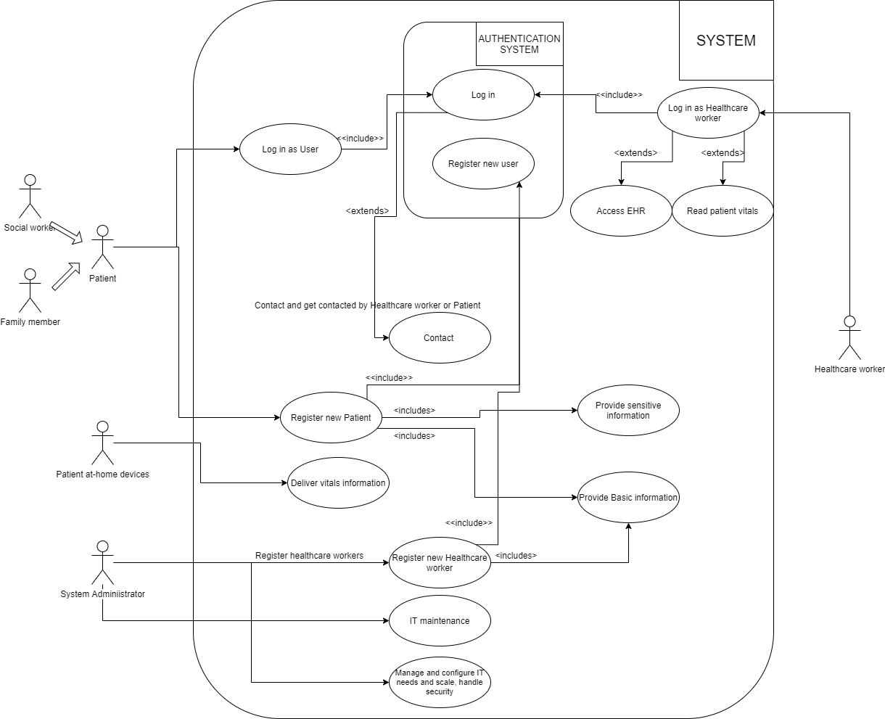

Identify and specify the main use cases of the system
-----------------------------------------------------

The Use Cases for this system is mainly performed by 4 main actors, Healthcare worker, System administrator, Patient-at-home devices and the Patient actor. The Patient actor is an abstraction for social workers and family members, whom function the same as a Patient actor. Patient-at-home devices are typically devices stationed at a patients home that will continually deliver data to the system about the patients vitals, such as blood sugar, blood pressure etc..

There is also the Use Cases of general tasks that needs to be done, for example when System Administrator needs access to the system to do maintenance work or manage and configure for eventual new needs. These are tasks, but not limited to, such as configuring new software, updating existing software, redistribution of available resources etc..

The diagram below represents the main use cases we have identified for this system.

.. Use case diagram

.. Use case Tables

The tables below are detailed descriptions of some of the flows in the Use Case diagram to explain what is happening at every step in a detailed manner.

.. csv-table::
	:header: **UC - Log in as User**, **Description**
	:widths: 3, 10

	"Actor", "Patient"
	"Prerequisites", "Patient is a registered user"
	"Post requisites", "User is logged in"
	"Main flow", "1. User enters credentials
	2. Credentials are sent to authentication server
	3. User is logged in"
	"Side flow", ""
	"Deviations", "1.1 User enters wrong credentials and is returned an error, is denied access to the system"

.. csv-table::
	:header: **UC - Log in as Healthcare worker**, **Description**
	:widths: 3, 10

	"Actor", "Healthcare worker"
	"Prerequisites", "Is a registered user"
	"Post requisites", "Healthcare worker is logged in"
	"Main flow", "1. Healthcare worker enters credentials
	2. Credentials are sent to authentication server
	3. Healthcare worker is logged in"
	"Side flow", "
	3.1 Healthcare worker accesses the EHR

	3.2 Healthcare worker gets the data he needs

	3.1 Healthcare worker requests a patient vitals from the system

	3.2 Healthcare worker gets the required data from the system"
	"Deviations", "1.1 Healthcare worker provides wrong credentials and is shown error message, is denied access to the system"

.. csv-table::
	:header: **UC - Log in**, **Description**
	:widths: 3, 10

	"Actor", "Patient and Healthcare worker"
	"Prerequisites", "Actor is a registered user"
	"Post requisites", "Actor is logged in"
	"Main flow", "1. Actor has sent right credentials
	2. Authentication server approves
	3. Authentication server sends approved"
	"Side flow", ""
	"Deviations", "1.1 Actor provides wrong credentials and is shown error message, is denied access to the system"

.. csv-table::
	:header: **UC - Register new Patient**, **Description**
	:widths: 3, 10

	"Actor", "Patient"
	"Prerequisites", "The patient has valid identification"
	"Post requisites", "Actor is now registered"
	"Main flow", "1. Actor sends in basic and sensitive information
	2. Authentication server receives request
	3. Authentication server sends the operation was succesful back to the actor
	4. Patient is given a user in the system"
	"Side flow", ""
	"Deviations", "1.1 Actor provides invalid info and is denied a user in the system"

.. csv-table::
	:header: **UC - Register new Healthcare worker**, **Description**
	:widths: 3, 10
	"Actor", "System Adminstrator"
	"Prerequisites", "Is a registered and valid user"
	"Post requisites", "New Healthcare worker account is made"
	"Main flow", "1. Actor has sent right credentials
	2. Authentication server approves
	3. Authentication server sends approved
	4. Healthcare worker is given a new user in the system"
	"Side flow", ""
	"Deviations", "1.1 Actor provides invalid info and is returned an error"

.. csv-table::
	:header: **UC - Register new user**, **Description**
	:widths: 3, 10

	"Actor", "Patient and System Administrator"
	"Prerequisites", ""
	"Post requisites", "New user has been created"
	"Main flow", "1. Actor has sent right credentials to authentication server
	2. Authentication server creates new user
	3. Authentication server returns success"
	"Side flow", ""
	"Deviations", "1.1 Actor provides invalid info and authentication server returns an error"

.. not finished!

.. csv-table::
	:header: **UC - Contact**, **Description**
	:widths: 3, 10

	"Actor", "Patient and Healthcare worker"
	"Prerequisites", "Actor is logged in"
	"Post requisites", "A communication channel between the two actors is established"
	"Main flow", "1. Actor uses the application and chooses who he wants to contact
	2. Request is sent to the system
	3. System sends a call to the contacted actor
	4. Contacted actor responds
	5. When call is finished, both users hang up and system terminates the communication channel"
	"Side flow", ""
	"Deviations", "4.1 Contacted actor does not responds
	"

.. csv-table::
	:header: **UC - Deliver vitals information**, **Description**
	:widths: 3, 10

	"Actor", "Patient-at-home devices"
	"Prerequisites", "Patient-at-home devices is powered and connected to the system"
	"Post requisites", "The patient vitals is registered in the system"
	"Main flow", "1. At intervals, patient-at-home devices connects to the system
	2. Actor sends over patient vitals data
	3. Actor is finished and system terminates connection"
	"Side flow", ""
	"Deviations", "1.1 A connection could not be established

	1.2 Error is logged on device and will try to connect again at next interval"
