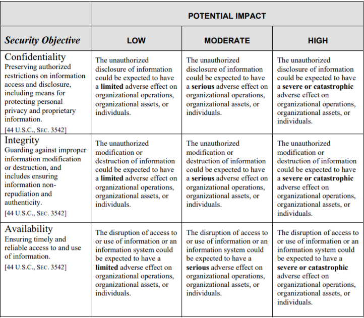

System Assets
-------------

From task 1 we identified the following assets in the system:

| 1. Authentication and Authorization Server
| 2. Database Server
| 3. Webserver
| 4. Internal Servers
| 5. Authenticative data
| 6. Cookies (from webserver)
| 7. Logs (metadata, eventlogs, etc.)
| 8. Configuration data
| 9. System software
| 10. Science data
| 11. EHR (Electronic Health Register
| 12. User data (e.g. date-of-birth, ID)
| 13. Patient vitals (e.g. blood pressure)

First, we have the different hardware servers and the
data they generate. These assets are the web server, database server,
authentication server and system, and internal servers.

The web server is responsible for most of the traffic between clients on the
application. As the web server is first point of contact for a user, it is
important to keep it secure. The database server contains on-site science data
and data necessary for the hospital's administration. The authentication server
and system is responsible for authenticating users who want to use the
application and authorization server to authorize resource access. A dishonest
authentication or authorization server will completely compromise the hospital's
security. Lastly we have the internal servers, which handle internal traffic
(e.g. contacting a printer), research processing and the local intranet.

All servers generate data that needs to be protected, such as the data within
databases, keys and passwords in the authentication server, logging and user
data from the web server, and configuration files and software that needs to be
kept safe on the internal servers. The software the hospital needs varies over
time, but will always be hosted on internal servers.

The Electronic Health Registry (EHR) is also vital to the organization. It is a third party asset, which the system acceses and uses. A disruption in this tool will prevent the healthcare personnel from doing their work and help their patients. Even though this is handled off-site, it is important that it is available and data is not tampered with on the way to the requesting user. Tampering or false data can lead to loss of life in patient, by for example administering the wrong amount of medication.

Patients must input sensitive data, such as their national identification
number, name, date of birth, contact details and basic health information. This
data is an asset, and the system will not function if this data has been
disrupted, e.g. altered, is falsified or wrong. It is important this data is
validated upon input, and kept safe from attackers at all times.

Patient vitality data, i.e. measurements taken at a patient's home and then sent
to the system, is a vital asset to the organization. A disruption would cause a
severe impact on the healthcare professionals' ability to complete their tasks,
and can cause massive damage to the hospitals' reputation as well as carrying
the possibility of damage to or the loss of the life of a patient.

Along every step of the way for system data transport, data is logged. This
includes metadata, for example from application traffic between two clients
(e.g. patient and doctor), and event logs. Event logs are there to provide a
look into what happened, and is necessary for when something goes wrong. The
logs may be disrupted, e.g. during an attack if the attacker tries to erase
logs, in an effort to cover their tracks to make the forensic work take longer.

To rank the identified assets we found, we use the United States Institute of Standards and Technology asset ranking to rank our assets (NIST 800-18):

Source: https://nvlpubs.nist.gov/nistpubs/Legacy/SP/nistspecialpublication800-18r1.pdf; 19.09-2020.

This is how we prioritize the identified assets in terms of confidentiality,
integrity and availability. They are given a "low", "moderate", or "high" score
dependent on the severity a disruption to the asset will cause. The "Score"
column is for the asset prioritization and is the common score gained by
confidentiality, integrity and availability.

.. csv-table::
	:header: **Asset**, **Confidentiality**, **Integrity**, **Availability**, **Score**
	:widths: 50, 15, 15, 15, 15

	"1. Authentication and Authorization Server", "High", "High", "High", "High (H)"
	"2. Database Server", "Low", "High", "Medium", "Medium (M)"
	"3. Webserver", "Low", "High", "High", "Medium (M)"
	"4. Internal Servers", "High", "High", "Low", "Medium (M)"
	"5. Authenticative data", "High", "High", "High", "High (H)"
	"6. Cookies (from webserver)", "Low", "Low", "Low", "Low (L)"
	"7. Logs (metadata, eventlogs, etc.)", "Low", "Medium", "High", "Medium (M)"
	"8. Configuration data", "Medium", "High", "Low", "Medium (M)"
	"9. System software", "High", "High", "High", "High (H)"
	"10. Science data", "Low", "Medium", "Low", "Low (L)"
	"11. EHR (Electronic Health Register)", "Medium", "High", "High", "High (H)"
	"12. User data (e.g. date-of-birth, ID)", "High", "High", "Low", "High (H)"
	"13. Patient vitals (e.g. blood pressure)", "High", "High", "High", "High (H)"

.. \* Access to, for example, the webservers "robot.txt" (which can give information about file hierarchy) will most likely only be used for reconnaissance.
	^^ Should stay or go?

Given the asset score, this is how we rank their prioritization of the assets:

.. csv-table::
	:header: **Asset Score**, **Description**
	:widths: auto

	"High (H)", "Very costly loss of major tangible assets or resources; significant violation of an organization’s mission, reputation or interest; or human death or serious injury"
	"Medium (M)", "Costly loss of tangible assets or resources, violation of an organization’s mission reputation or interest, or human injury"
	"Low (L)", "Loss of some tangible assets or resources or an effect on an organization’s mission, reputation or interest"

To sum up, we see that the most critical assets to the organization is user and
patient data, the authentication and authorization security and their respective
data, and finally the system software on the internal computers.
